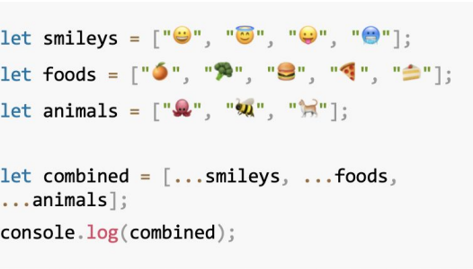

#### Copying/Cloning an Array - slice()
let foo = ["fee", "fi", "fo", "fum"];
let fooCopy = foo.slice();

#### Checking if an Object Is an Array
Array.isArray(numbers)
numbers.constructor === Array

#### Deleting an Array Item - use indexOf and splice
splice(index, number, itemadd01, itemadd02)
remove number elements before index and insert itemadd at index.

##### delete is just remove value, but array item still there and has "empty" value

#### Emptying an array - set length = 0
array.length = 0;

#### Making Your Array Items Unique - use Set
let names = ["Peter", "Joe", "Cleveland", "Quagmire", "Joe"];
let uniqueNames = [...new Set(names)];

#### Sorting items - allows to specify exactly how to sort.
array.sort(comparedValue)

#### Shuffling / Randomly Rearranging
Array.prototype.shuffle = function () {
let input = this;
for (let i = input.length - 1; i >= 0; i--) {   
    let randomIndex = Math.floor(Math.random() * (i + 1));
    let itemAtIndex = input[randomIndex];
    input[randomIndex] = input[i];
    input[i] = itemAtIndex;
}
return input;
}

#### Picking a Random Item
let myArray = ["Unos", "Dos", "Tres", "Catorce"];
let value = myArray[Math.floor(Math.random() * myArray.length)];

#### Merging array

#### Swapping Items
