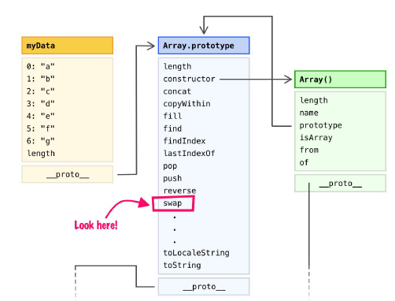

####Adding to the Prototype
```js
Array.prototype.swap = function(index_A, index_B){
    let input = this;
    let temp = input[index_A];
    input[index_A] = input[index_B];
    input[index_B] = temp;
}
myData.swap(2, 5);
console.log(myData); // ["a", "b", "f", "d", "e", "c", "g"]
```


#### Subclassing our Array
```js
class AwesomeArray extends Array {
    swap(index_A, index_B) {
    let input = this;
    let temp = input[index_A];
    input[index_A] = input[index_B];
    input[index_B] = temp;
    }
}
```