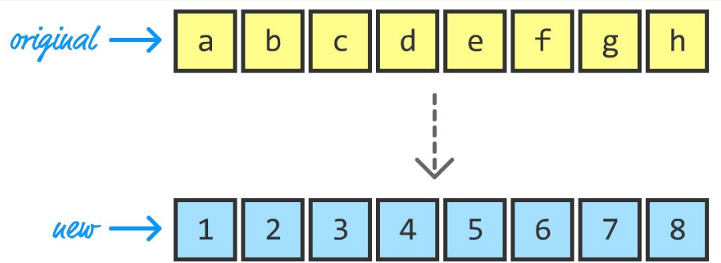
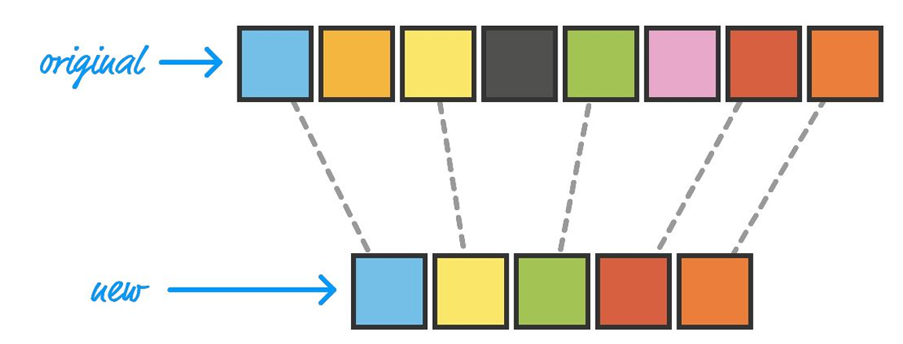
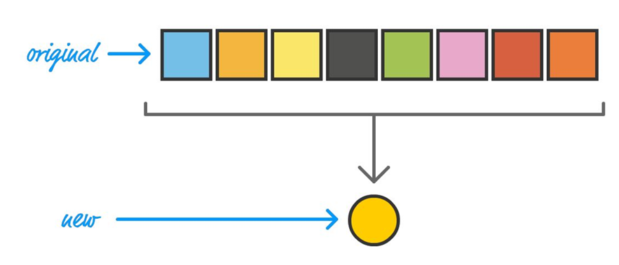

### Array Mapping

##### let newArray = originalArray.map(someFunction);

let names = ["marge", "homer", "bart", "lisa", "maggie"];
function capitalizeItUp(item) {
&nbsp;&nbsp;&nbsp;&nbsp;let firstLetter = item.charAt(0).toUpperCase();
&nbsp;&nbsp;&nbsp;&nbsp;return firstLetter + item.slice(1);
}
let newNames = names.map(capitalizeItUp);

### Array Filtering

let numbers = [1, 2, 3, 4, 5, 6, 7, 8, 9, 10, 11, 12];
let evenNumbers = numbers.filter((item) => item % 2 ==0)

 ### Array Reducing

let numbers = [1, 2, 3, 4, 5, 6, 7, 8, 9, 10, 11, 12];
let sum = numbers.reduce((total, current) => total + current, 0)

let words = ["Where", "do", "you", "want", "to", "go", "today?"];
let phrase = words.reduce(function(total, current, index) {
&nbsp;&nbsp;&nbsp;&nbsp;if (index == 0) {
&nbsp;&nbsp;&nbsp;&nbsp;&nbsp;&nbsp;&nbsp;&nbsp;return current;
&nbsp;&nbsp;&nbsp;&nbsp;} else {
&nbsp;&nbsp;&nbsp;&nbsp;&nbsp;&nbsp;&nbsp;&nbsp;return total + " " + current;
&nbsp;&nbsp;&nbsp;&nbsp;}
 }, "");

####array.map(callback(item, current index, array))
####array.filter(callback(item, current index, array))
####array.reduce(callback(totalsum, item, current index, array))

Functional programming is a way of writing your code where you use functions that:
Can work inside other functions
Avoid sharing or changing state
Return the same output for the same input