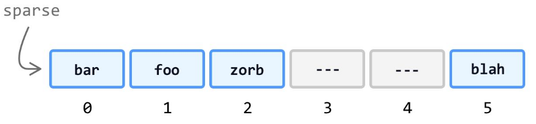

### for loop
items = [a,b,c]
#####for (let i = 0; i < items.length; i++)
    // do something

### for ...of loop
animals = [cat, dog, lion]
#####for (let animal of animals)
    // do something

#####for (let [index, animal] of animals.entries())
    {console.log(index + ": " + animal)}

### forEach
##### animals.forEach((item) => console.log(item)
##### animals.forEach((item, index) => console.log(index + ": " + item))

### Looping in Reverse
##### for (let i = names.length - 1; i >= 0; i--) 

    let reversedNames = names.slice().reverse()
##### for (let [index, name] of reversedNames.entries())
##### reversedNames.forEach((name, index) => console.log(index + ": " + name));

### Iterating Through A Sparse Array

