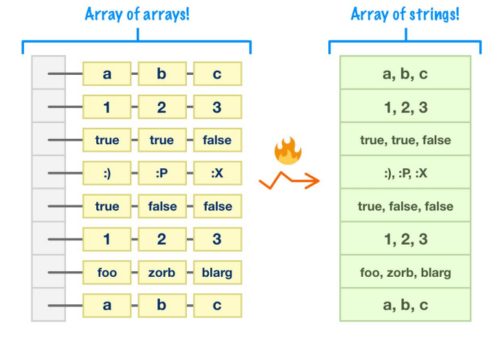
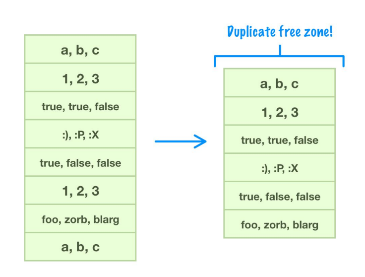
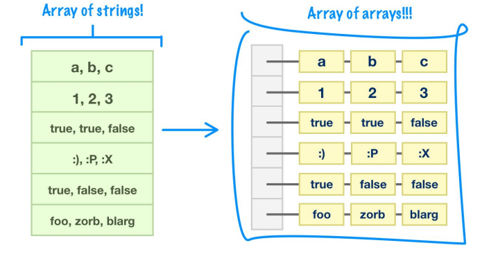
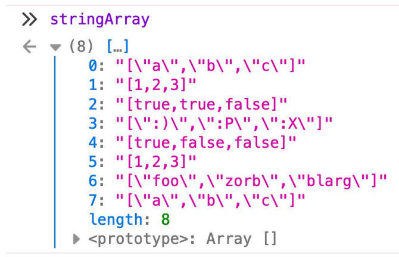

let bigArray = [["a", "b", "c"],
 [1, 2, 3],
 [true, true, false],
 [":)", ":P", ":X"],
 [true, false, false],
 [1, 2, 3],
 ["foo", "zorb", "blarg"],
 ["a", "b", "c"]];

let stringArray = bigArray.map(JSON.stringify);
console.log(stringArray);

#### Creating the set
let uniqueStringArray = new Set(stringArray);