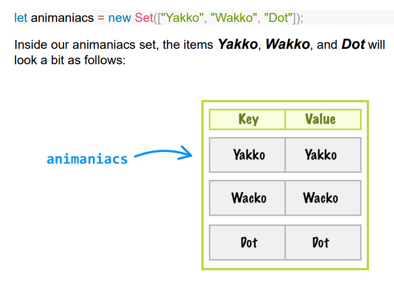

#### Creating a Set, Part I
let mySet = new Set();

#### Adding Items to a Set
let mySet = new Set();
mySet.add("blarg");
mySet.add(10);
mySet.add(true);

mySet.add("blarg") // this one is not added, code is ok

#### this array[1,2] will be add 2 times, cause use === 2 arrays are distinct
let anotherSet = new Set();
anotherSet.add(true);
anotherSet.add("abc");
anotherSet.add([1, 2]);
anotherSet.add([1, 2]);

#### myArray will only add one time, object refernces, === operator will say the same
let myArray = [1, 2];
let anotherSet = new Set();
anotherSet.add(true);
anotherSet.add("abc");
anotherSet.add(myArray);
anotherSet.add(myArray);

#### Creating a Set, Part 2 - any iterable object.
pass in an existing collection of data when creating our set to pre-populate it:
let someValues = ["a", "b", "c", 10, "a", "c", false];
let newSet = new Set(someValues);
console.log(newSet); // "a", "b", "c", 10, false

PASS A STRING
let textSet = new Set("diplodocus");
console.log(textSet); // d, i, p, l, o, c, u, s

#### Checking the Size of Our Set - set.size
let setCount = new Set();
console.log(setCount.size); // 0

#### Deleting Items from a Set - set.clear()
let vegetables = new Set([" ?? "," ?? ", " ?? ", " ?? ", " ?? "]);
console.log(vegetables.size); // 5
vegetables.clear();
console.log(vegetables.size); // 0

#### Checking if an Item Exists - has("item")
let ingredients = new Set(["milk", "eggs", "cheese", "tofu"]);
if (ingredients.has("tofu")) {
 ingredients.delete("tofu");
 ingredients.add("bacon");
}
console.log(ingredients); // "milk", "eggs", "cheese", "bacon"

#### Looping Through Items in a Set - for ... of
let textSet = new Set("diplodocus");
for (let letter of textSet) {
 console.log(letter);
}

#### Entries, Keys, and Values

let animaniacs = new Set(["Yakko", "Wakko", "Dot"]);
console.log(animaniacs.keys());
console.log(animaniacs.values());
console.log(animaniacs.entries());